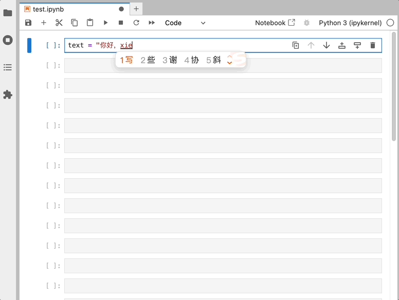

# AskChat

<div align="center">
    <a href="https://pypi.python.org/pypi/askchat">
        
    </a>
    <a href="https://github.com/cubenlp/askchat/actions/workflows/test.yml">
        
    </a>
    <a href="https://cubenlp.github.io/askchat/">
        
    </a>
    <a href="https://codecov.io/gh/cubenlp/askchat">
        
    </a>
</div>

<div align="center">


[English](README-en.md) | [简体中文](README.md)
</div>

通过命令行运行的 ChatGPT 交互工具，随时随地调用 ChatGPT。

<div align="center">
    <div style="margin-top: 10px; color: #555;">终端调用</div>
    
</div>

<div align="center">
    <div style="margin-top: 10px; color: #555;">Jupyter Lab</div>
    
</div>

## 安装及配置

```bash
pip install askchat --upgrade
```

配置环境变量：

```bash
export OPENAI_API_KEY="your-api-key"
export OPENAI_API_BASE="https://api.openai.com/v1"
export OPENAI_API_BASE_URL="https://api.openai.com"
export OPENAI_API_MODEL="gpt-3.5-turbo"
```

注：`OPENAI_API_BASE` 变量优先于 `OPENAI_API_BASE_URL` 变量，二者选一即可。

## 使用方法

使用环境变量，进行简单的问答：

```bash
ask hello world
```

除此之外，可使用 `askchat` 进行更灵活的对话，使用 `askenv` 管理环境配置。

## AskChat

`askchat` 支持 API 调试，对话管理等功能。

### 使用示例

<div align="center">
    <div style="margin-top: 10px; color: #555;">1. API 调试</div>
    
</div>

<div align="center">
    <div style="margin-top: 10px; color: #555;">2. 获取可用模型列表</div>
    
</div>

<div align="center">
    <div style="margin-top: 10px; color: #555;">3. 多轮对话，保存对话，加载对话等</div>
    
</div>

<div align="center">
    <div style="margin-top: 10px; color: #555;">4. 指定参数，使用不同的模型和 API</div>
    
</div>

### 对话管理

用户保存、加载、删除和列出对话历史记录，以及继续之前的对话。

| 参数                | 示例             | 解释                                       |
|---------------------|------------------|--------------------------------------------|
| `-c`           | `askchat -c <message>`     | 继续上一次的对话                             |
| `--regenerate` | `askchat -r`     | 重新生成上一次对话的最后回复                   |
| `--load`       | `askchat -l <file>` | 加载历史对话          |
| `--print`      | `askchat -p [<file>]`     | 打印上次或指定的对话历史                       |
| `--save`       | `askchat -s <file>` | 将当前对话历史保存到文件                      |
| `--delete`     | `askchat -d <file>` | 删除指定的对话历史文件                        |
| `--list`       | `askchat --list` | 列出所有保存的对话历史文件                     |

所有对话保存在 `~/.askchat/`，最近一次对话保存在 `~/.askchat/_last_chat.json`。

### 模型参数

`askchat` 的默认参数，这些参数用于直接与 ChatGPT 交互或者配置 API 的连接信息。

| 参数            | 示例            | 解释                               |
|-----------------|-----------------|-----------------------------------|
| `<message>`     | `askchat hello` | 最简单的对话          |
| `--model`  | `-m gpt-3.5-turbo` | 指定使用的模型名称                  |
| `--base-url` | `-b https://api.example.com` | 设置 Base URL (不包含 `/v1`) |
| `--api-base`    | `--api-base https://api.example.com/v1` | 设置 Base URL  |
| `--api-key` | `-a sk-xxxxxxx` | 提供 OpenAI API 密钥                |
| `--option` | `-o top_p 1 temperature 0.5` | 设置请求参数 |
| `--use-env` | `-u prod` | 使用指定配置文件加载环境变量，详见 [AskEnv](#askenv) |

注：一些模型 API，比如智谱，使用 `/v4` 作为 API 的基础路径，这时得用 `--api-base` 参数。

### 其他参数

辅助功能，如生成配置文件、调试日志、打印模型列表和显示版本信息等，使用 `--help` 查看所有支持的参数。

| 参数                      | 示例                 | 解释                                       |
|---------------------------|----------------------|--------------------------------------------|
| `--generate-config`  | `askchat --generate-config` | 生成配置文件，保存在 `~/.askchat/.env` 中  |
| `--print-url`       | `askchat hello --print-url` | 打印实际请求的 URL                        |
| `--debug`            | `askchat --debug`    | 打印调试日志                                |
| `--valid-models`     | `askchat --valid-models` | 打印包含 "gpt" 名称的模型列表            |
| `--all-valid-models` | `askchat --all-valid-models` | 打印所有的模型                     |
| `--version`          | `askchat -v`         | `askchat` 的版本信息                    |

注：`--all-valid-models` 会打印所有可用模型，包括 Embedding, dalle-3, tts 等，使用 `--valid-models` 可以过滤掉这些。

## AskEnv

`askenv` 用于管理不同的环境配置，包括创建、激活、删除等操作，便于在不同的渠道间切换。

### 示例

<div align="center">
    <div style="margin-top: 10px; color: #555;">1. 创建渠道</div>
    
</div>

<div align="center">
    <div style="margin-top: 10px; color: #555;">2. 编辑渠道</div>
    
</div>

### 基本用法

1. 创建一个新的环境配置，使用 `new` 命令。

    ```bash
    askenv new <name> [-a API_KEY] [-b BASE_URL] [--api-base API_BASE] [-m MODEL]
    ```

    或者用 `askchat --generate-config` 从环境变量生成默认配置：

    ```bash
    askchat --generate-config
    ```

2. 激活某个环境，将其设置为当前使用的配置。

    ```bash
    askenv use <name>
    ```

3. 删除指定的环境配置文件。

    ```bash
    askenv delete <name>
    askenv delete --default
    ```

4. 列出当前所有可用环境。

    ```bash
    askenv list
    ```

5. 显示指定环境的配置信息，如果没有指定环境名称，则显示默认环境的配置。

    ```bash
    askenv show [name]
    ```

6. 将当前激活的环境配置保存为指定名称的配置文件。

    ```bash
    askenv save <name>
    ```

7. 更新指定或默认环境配置的一项或多项设置。

    ```bash
    askenv config [name] [-a API_KEY] [-b BASE_URL] [--api-base API_BASE] [-m MODEL]
    ```

## 问题和反馈

使用过程中有任何问题或建议，欢迎提交 [Issue](https://github.com/cubenlp/askchat/issues)。